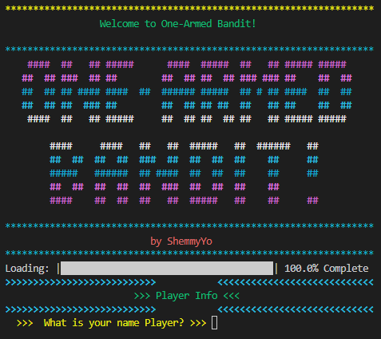
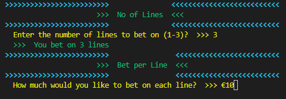
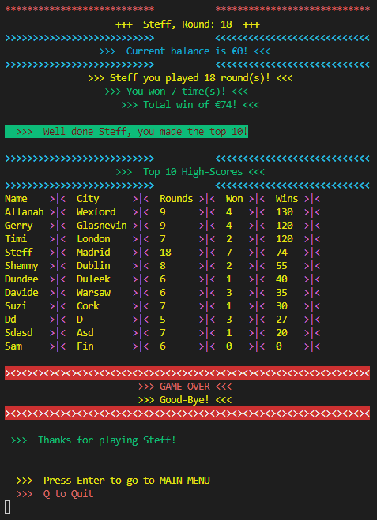

# Project Portfolio 3 - Python

## One-Armed Bandit!

> known also as slot machine (American English), fruit machine (British English) or poker machine (Australian English and New Zealand English and is a gambling game that creates a game of chance for its customers [Wikipedia](https://en.wikipedia.org/wiki/One_Armed_Bandit) 

It is a Python terminal game, deployed on Heroku using Code Institute's mock terminal to run.
This project has been designed for educational purposes 

Users are welcomed by the main menu where they enter name and city before being brought to the main menu where they can choose option 1 to start the game or option 2 to view instructions (Q to Quit). 

After choosing to start the game they are type in their name and city .
Users are given the option to start with a default balance of €100 or change it to pre-defined amount or set it manually hence change difficulty level.

Next, users are asked to choose the number of lines they wish to bet on (1-3). The more lines the bigger chance of winning, however, the user bet is then multiplied by the number of lines the user wishes to bet on and deducted from the total balance. Once, users choose the number of lines to bet on, this information is confirmed and printed back to the screen. 

Users then are asked to type in how much would they like to bet per line - this information is also confirmed and printed back to users unless the balance is insufficient to cover the bet. in this instance, users are asked to repeat and choose the number of lines to bet on and confirm bet per line.

Once lines and bet are confirmed, users are presented with the information of their bet total, results of the round and lines and amount they won/lost on. 

The total balance is then adjusted and, if allowed to play, users are asked to play another round. 
If a user loses the whole balance, the game is over and users are brought back to the main menu.

You can view the live, deployed application here: <a href ='https://shemmy-slot-mashine.herokuapp.com/' target="_blank">One-Armed Bandit!</a>


## __Live Web-Page__
[One-Armed Bandit!](https://shemmy-slot-mashine.herokuapp.com/)

## __GitHub Repository__
[GitHub Repository](https://github.com/ShemmyYo/slot-mashine-python/)

## __Tech Stack__

 __Python3__ 
 __Gitpod__ 
 __Git__

 __HTML5__
 __CSS3__

***

# Contents

- [Project Goal](#project-goal)
- [Brief](#brief)
- [UX User Experience](#ux-user-experience)
    - [User Stories](#user-stories)
    - [Flowchart](#flowchart)
    - [Class Object](#classobject)
- [Features](#features)
    - [Existing Features](#existing-features)
        - [Main Menu](#main-menu)
        - [Instructions](#home)
        - [Deposit Change Option](#deposit)
        - [Setting lines to bet on and bet mount (difficulty level)](#difficulty)
        - [Turn results](#turn-results)
        - [Game Over](#game-over)
    - [Future Features](#future-features)
        - [High Scores](#scores)
- [Technologies Used](#technologies-used)
    - [Imported Libraries and Packages](#libraries-imported)
- [Testing](#testing)
- [Deployment](#deployment)
    - [Deploy to Heroku](#deploy-to-heroku)
    - [Local Deployment](#local-deployment)
    - [To Fork the Repository](#to-fork-the-repository)
- [Credits](#credits)
    - [Code](#code)
    - [Content](#content)
    - [Design](#design)
- [Acknowledgements](#acknowledgements)

***
## __Project Goals__

The project goal was to create a user-friendly game and deliver an easy and satisfiying command line interface directory.

The project has been built by using Python.

[Back to Content](<#contents>)
***
## __Brief__

I wish to demonstrate my competency as a Software Developer and showcase Python skills and abilities to potential Employers / Recruiters and all who want to cooperate with me on future projects.

[Back to Content](<#contents>)
***
## __UX User Experience__
### __User Stories__

__As a Player, I wish:__ 
- to play a simple and fun but still challenging game.
- to be able to see instructions before the start of the game.
- to play a game that navigates easyly.
- to be able to set bet amount.
- to be able to change game difficulty by changing number of lines I bet on.
- to be given feedback if I entered invalid data. 
- to be able to go reset the game.
- to be able to see current balance.
- to be encouraged to replay and increase scores.

[Back to Content](<#contents>)
***
### __Flowchart__

The below flowchart has been created prior to my code to give me a clear view of what needed to be implemented. It clearly indicates the layout and structure of the program including where the user needs to be asked for input, where the computer validates the input and how to handle invalid inputs, where the program should subtract and add to the user's balance.


### __Class Object__
OOC (Object Oriented Class) has been added in this project to create a Player class.
I used [Real Python](https://realpython.com/python3-object-oriented-programming/) to create it.

```python
class Player:
    def __init__(self, name, place, rounds, balance):
        self.name = name
        self.place = place
        self.rounds = 0
        self.balance = DEPOSIT
```

[Back to top](<#contents>)
***

## __Features__
### __Welcome Screen__
The user is welcomed to the game wtih game logo and prompted to input their details.



***

### __Main Menu__
Main menu enables the user to start the game, view the game instructions and exit the game.

<details open><summary>Main Menu IMAGE</summary>


</details>

***

### __Instructions__
Option 2 on main menu displays game instructions. 
You can come back to the main menu by hitting the Enter key or quit by hitting Q key.

<details open><summary>Instructions IMAGE</summary>


</details>

***

### __Deposit Change Option (difficulty level)__
Changing deposit may make the game easier (if set to higher) or more diffcult (if set lower)

<details open><summary>Deposit Change Option IMAGE</summary>


</details>

***

### __Setting lines to bet on and bet mount (difficulty level)__
Users can set the number of lines (1-3) to bet on and bet amount which makes the game easier (if set to 3 lines) or more diffcult (if set 1 lines)

<details open><summary>Setting lines and bet IMAGE</summary>


</details>

***

### __Turn results__
Reluts are presented in grapicly same way as on a realone-armed bandid.
Each line is analised and results for each line is printed (includin the amount won/lost and number of winning/loosing lines)

<details open><summary>Results IMAGE</summary>


</details>

***

### __Progress Bar__
Added for visual enhancment. 

<details open><summary>Progress Bar IMAGE</summary>


</details>

***

### __Game Over__
Showing final result of the game

<details open><summary>Game Over IMAGE</summary>


</details>

[Back to Content](<#contents>)
***

## __Future Features__
### __High Scores__

Game high-scores - I plan to add local high-score board so users can see how they compare to other users.


[Back to Content](<#contents>)
***
## __Technologies Used__

- [Python](https://www.python.org/) - To provide the functionality to the program
- [Heroku](https://dashboard.heroku.com/apps) Used to deploy application.
- [HTML5](https://html.spec.whatwg.org/) - provides content and structure 
- [CSS](https://www.w3.org/Style/CSS/Overview.en.html) - provides styling 
- [MindManager](https://app.mindmanager.com/) - for Flowcharts
- [Aurora Gradient Animation](https://dev.to/albertwalicki/aurora-ui-how-to-create-with-css-4b6g) - created Aurora gradient background for website
- [Chrome Dev Tools](https://developer.chrome.com/docs/devtools/) - used extensively to experiment with grid, flexbox and general responsiveness
- [Gitpod](https://www.gitpod.io/) - used to create and host the website
- [Github](https://github.com/) - used to deploy the website 
- [Git](https://git-scm.com/) - used for version control through the Gitpod terminal
- [Am I Responsive](https://ui.dev/amiresponsive) - to create an image displaying the home page on various devices 
- [Grammarly](https://app.grammarly.com/) - to make writing clear and engaging as well as eliminate grammar errors
- [CI Python Linter](https://pep8ci.herokuapp.com/)
- [PyInputPlus](https://pypi.org/project/PyInputPlus/) - used to validate user inputs

### __Imported Libraries and Packages__

- [random](https://docs.python.org/3/library/random.html) was used to select symbols for reels
- [os](https://docs.python.org/3/library/os.html) was used to create the clear_screen function to enhance user experience and reduce clutter on screen
- [time](https://docs.python.org/3/library/time.html) used time.sleep to enhance user experience and to pause

[Back to Content](<#contents>)
***

## __Testing__
### __test___

[Back to Content](<#contents>)
***
## __Deployment__
### __Deploy to Heroku__

This project uses [Heroku](https://www.heroku.com), a platform as a service (PaaS) that enables developers to build, run, and operate applications entirely in the cloud.

Deployment steps are as follows, after account setup:

- Select *New* in the top-right corner of your Heroku Dashboard, and select *Create new app* from the dropdown menu.
- Your app name must be unique, and then choose a region closest to you (EU or USA), and finally, select *Create App*.
- From the new app *Settings*, click *Reveal Config Vars*, and set the value of KEY to `PORT`, and the value to `8000` then select *add*.
- Further down, to support dependencies, select *Add Buildpack*.
- The order of the buildpacks is important, select `Python` first, then `Node.js` second. (if they are not in this order, you can drag them to rearrange them)

Heroku needs two additional files in order to deploy properly.
- requirements.txt
- Procfile

You can install this project's requirements (where applicable) using: `pip3 install -r requirements.txt`. If you have your own packages that have been installed, then the requirements file needs updated using: `pip3 freeze --local > requirements.txt`

The Procfile can be created with the following command: `echo web: node index.js > Procfile`

For Heroku deployment, follow these steps to connect your GitHub repository to the newly created app:

- In the Terminal/CLI, connect to Heroku using this command: `heroku login -i`
- Set the remote for Heroku: `heroku git:remote -a <app_name>` (replace app_name with your app, without the angle-brackets)
- After performing the standard Git `add`, `commit`, and `push` to GitHub, you can now type: `git push heroku main`

The frontend terminal should now be connected and deployed to Heroku.

[Back to Content](<#contents>)
***
### __Local Deployment__

To make a local copy of this project, you can clone it. In your IDE Terminal, type the following command to clone my repository:

- `git clone https://github.com/shemmyyo/slot-mashine-python.git`

[Back to Content](<#contents>)
***
### __To Fork the Repository__

To make a copy or ‘fork’ the repository - 

1. Log into GitHub and locate the repository  
2. On the right-hand side of the page select the ‘fork’ option to create and copy the original

Alternatively, if using Gitpod, you can click below to create your workspace using this repository

[Back to Content](<#contents>)
***
## __Credits__

Throughout the building process I found many helpful tutorials online.
I sometimes applied principles within them to the site, after fully understanding their code and modifying to fit the site's needs.

[Back to Content](<#contents>)
### __Code__

- Code to create clear_screen function taken from [GeeksforGeeks](https://www.geeksforgeeks.org/clear-screen-python/)
***
### __Content__
***
### __Design__

- Flowchart was made using 

[Back to Content](<#contents>)
***
## __Acknowledgements__

As always, big thank you to [Harry Dhillon](https://github.com/Harry-Leepz), my mentor who provided me with guide and excellent feedback throughout the project

One-Armed Bandit! was developed for educational purpouses and as part of my Diploma in Software Development with [Code Institute](https://codeinstitute.net/). 

Shemmy, 2022

[Back to top](<#project-portfolio-3---python>)