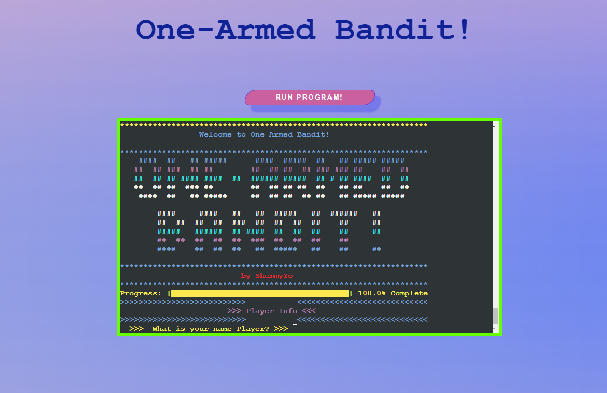

# __Project Portfolio 3 - Python__

## One-Armed Bandit!

> Known also as slot machine (American English), fruit machine (British English) or poker machine (Australian English and New Zealand English [Wikipedia](https://en.wikipedia.org/wiki/One_Armed_Bandit) and is a gambling game that creates a game of chance for its customers - this is my take on this classic.

One-Armed Bandit! is a Command Line Interface styled application, designed for a user to play this classic game. 
It has been deployed on Heroku using Code Institute's mock terminal to run.
This project has been designed for educational purposes 

You can view the live program here: <a href ='https://shemmy-slot-mashine.herokuapp.com/' target="_blank">One-Armed Bandit!</a>

## __Live Web-Page__
[One-Armed Bandit!](https://shemmy-slot-mashine.herokuapp.com/)

## __GitHub Repository__
[GitHub Repository](https://github.com/ShemmyYo/slot-mashine-python/)

## __Tech Stack__

 __Python3__
 __Gitpod__
 __Git__

 __HTML5__
 __CSS3__
 __JavaScript__

***

# Contents

- [Project Goal](#project-goal)
- [Brief](#brief)
- [UX User Experience](#ux-user-experience)
    - [Site Aim](#site-aim)
    - [User Stories](#user-stories)
    - [Flowchart](#flowchart)
- [Features](#features)
    - [Existing Features](#existing-features)
        - [Instructions](#home)
        - [Game](#game)
    - [Future Features](#future-features)
        - [High Scores](#scores)
- [Technologies Used](#technologies-used)
    - [Imported Libraries and Packages](#libraries-imported)
- [Testing](#testing)
- [Deployment](#deployment)
    - [Deploy to Heroku](#deploy-to-heroku)
    - [Local Deployment](#local-deployment)
    - [To Fork the Repository](#to-fork-the-repository)
- [Credits](#credits)
    - [Code](#code)
    - [Content](#content)
    - [Design](#design)
- [Acknowledgements](#acknowledgements)

***
## __Project Goals__
[Back to top](<#contents>)
***
## __Brief__
[Back to top](<#contents>)
***
## __UX User Experience__
[Back to top](<#contents>)
***
### __Site Aim__
[Back to top](<#contents>)
***
### __User Stories__
[Back to top](<#contents>)
***
### __Flowchart__
[Back to top](<#contents>)
***
## __Features__
[Back to top](<#contents>)
***
### __Existing Features__
[Back to top](<#contents>)
***
#### __Instructions__
[Back to top](<#contents>)
***
#### __Game__
[Back to top](<#contents>)
***
#### __Instructions__
[Back to top](<#contents>)
***
### __Future Features__
#### __High Scores__

- Local Leaderboard - I plan to add local high-score board so users can see how they compare to other users.

[Back to top](<#contents>)
***
## __Technologies Used__

- [Python](https://www.python.org/) - To provide the functionality to the program
- [Heroku](https://dashboard.heroku.com/apps) Used to deploy application.
- [HTML5](https://html.spec.whatwg.org/) - provides content and structure 
- [CSS](https://www.w3.org/Style/CSS/Overview.en.html) - provides styling 
- [MindManager](https://app.mindmanager.com/) - for Flowcharts
- [Aurora Gradient Animation](https://dev.to/albertwalicki/aurora-ui-how-to-create-with-css-4b6g) - created Aurora gradient background for website
- [Chrome Dev Tools](https://developer.chrome.com/docs/devtools/) - used extensively to experiment with grid, flexbox and general responsiveness
- [Gitpod](https://www.gitpod.io/) - used to create and host the website
- [Github](https://github.com/) - used to deploy the website 
- [Git](https://git-scm.com/) - used for version control through the Gitpod terminal
- [Am I Responsive](https://ui.dev/amiresponsive) - to create an image displaying the home page on various devices 
- [Grammarly](https://app.grammarly.com/) - to make writing clear and engaging as well as eliminate grammar errors
- [CI Python Linter](https://pep8ci.herokuapp.com/)
- [PyInputPlus](https://pypi.org/project/PyInputPlus/) - used to validate user inputs

### __Imported Libraries and Packages_

- [random](https://docs.python.org/3/library/random.html) was used to select symbols for reels
- [os](https://docs.python.org/3/library/os.html) was used to create the clear_screen function to enhance user experience and reduce clutter on screen
- [time](https://docs.python.org/3/library/time.html) used time.sleep to enhance user experience and to pause

[Back to top](<#contents>)
***
## __Deployment__
### __Deploy to Heroku__

This project uses [Heroku](https://www.heroku.com), a platform as a service (PaaS) that enables developers to build, run, and operate applications entirely in the cloud.

Deployment steps are as follows, after account setup:

- Select *New* in the top-right corner of your Heroku Dashboard, and select *Create new app* from the dropdown menu.
- Your app name must be unique, and then choose a region closest to you (EU or USA), and finally, select *Create App*.
- From the new app *Settings*, click *Reveal Config Vars*, and set the value of KEY to `PORT`, and the value to `8000` then select *add*.
- Further down, to support dependencies, select *Add Buildpack*.
- The order of the buildpacks is important, select `Python` first, then `Node.js` second. (if they are not in this order, you can drag them to rearrange them)

Heroku needs two additional files in order to deploy properly.
- requirements.txt
- Procfile

You can install this project's requirements (where applicable) using: `pip3 install -r requirements.txt`. If you have your own packages that have been installed, then the requirements file needs updated using: `pip3 freeze --local > requirements.txt`

The Procfile can be created with the following command: `echo web: node index.js > Procfile`

For Heroku deployment, follow these steps to connect your GitHub repository to the newly created app:

- In the Terminal/CLI, connect to Heroku using this command: `heroku login -i`
- Set the remote for Heroku: `heroku git:remote -a <app_name>` (replace app_name with your app, without the angle-brackets)
- After performing the standard Git `add`, `commit`, and `push` to GitHub, you can now type: `git push heroku main`

The frontend terminal should now be connected and deployed to Heroku.

[Back to top](<#contents>)
***
### __Local Deployment__

To make a local copy of this project, you can clone it. In your IDE Terminal, type the following command to clone my repository:

- `git clone https://github.com/shemmyyo/slot-mashine-python.git`

[Back to top](<#contents>)
***
### __To Fork the Repository__

To make a copy or ‘fork’ the repository - 

1. Log into GitHub and locate the repository  
2. On the right-hand side of the page select the ‘fork’ option to create and copy the original

Alternatively, if using Gitpod, you can click below to create your workspace using this repository

[Back to top](<#contents>)
***
## __Credits__

Throughout the building process I found many helpful tutorials online.
I sometimes applied principles within them to the site, after fully understanding their code and modifying to fit the site's needs.

[Back to top](<#contents>)
### __Code__

- Code to create clear_screen function taken from [GeeksforGeeks](https://www.geeksforgeeks.org/clear-screen-python/)
***
### __Content__
***
### __Design__

- Flowchart was made using 
- [Colorama tutorial](https://youtu.be/u51Zjlnui4Y) - For all coloured text

***
## __Acknowledgements__

As always, big thank you to [Harry Dhillon](https://github.com/Harry-Leepz), my mentor who provided me with guide and excellent feedback throughout the project

One-Armed Bandit! was developed for educational purpouses and as part of my Diploma in Software Development with [Code Institute](https://codeinstitute.net/). 

Shemmy, 2022

[Back to top](<#contents>)
***
The End

